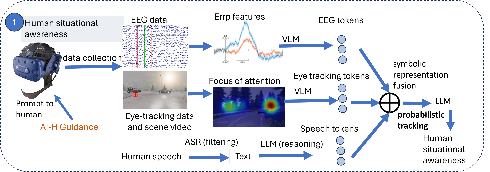

## Human situational awareness fusion




We implement Bayesian Inverse Planning Accelerated by Language Model to fuse human situational awareness from EEG, eye-tracking, and speech.

```bash
python inverse_symbolic_planner_erp.py --data_path erp.json --model_name_or_path meta-llama/Llama-2-7b-hf --load_lora 1 --lora_name_or_path output/checkpoint-llama --output_path output.txt
```

To finetune the language model (optional):

```bash
python generate_finetuning_dataset.py --data_path finetuning_data --output_file formatted_finetuning_data.json
```

```bash
python finetuning.py --train_file formatted_finetuning_data.json --model_name_or_path meta-llama/Llama-2-7b-hf --fisher_matrix_path fisher-matrix/fisher-matrix-6B --per_device_train_batch_size 4 --gradient_accumulation_steps 4 --lr 5e-5 --num_epochs 3 --ewc_lambda 0.5 --output_dir output_finetuning.txt
```


